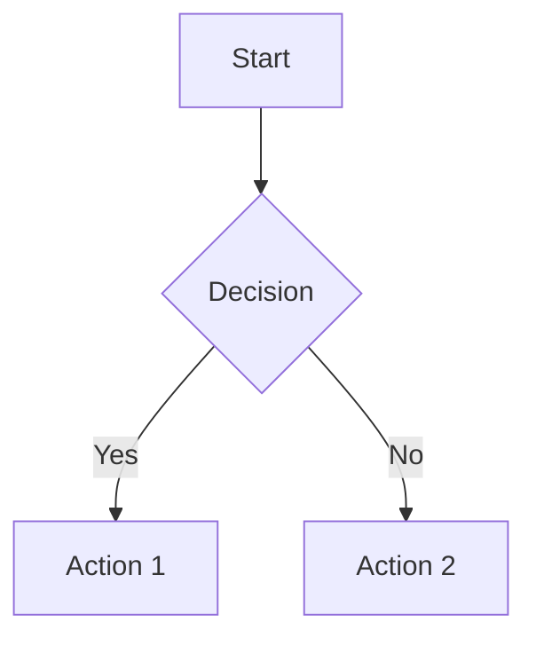
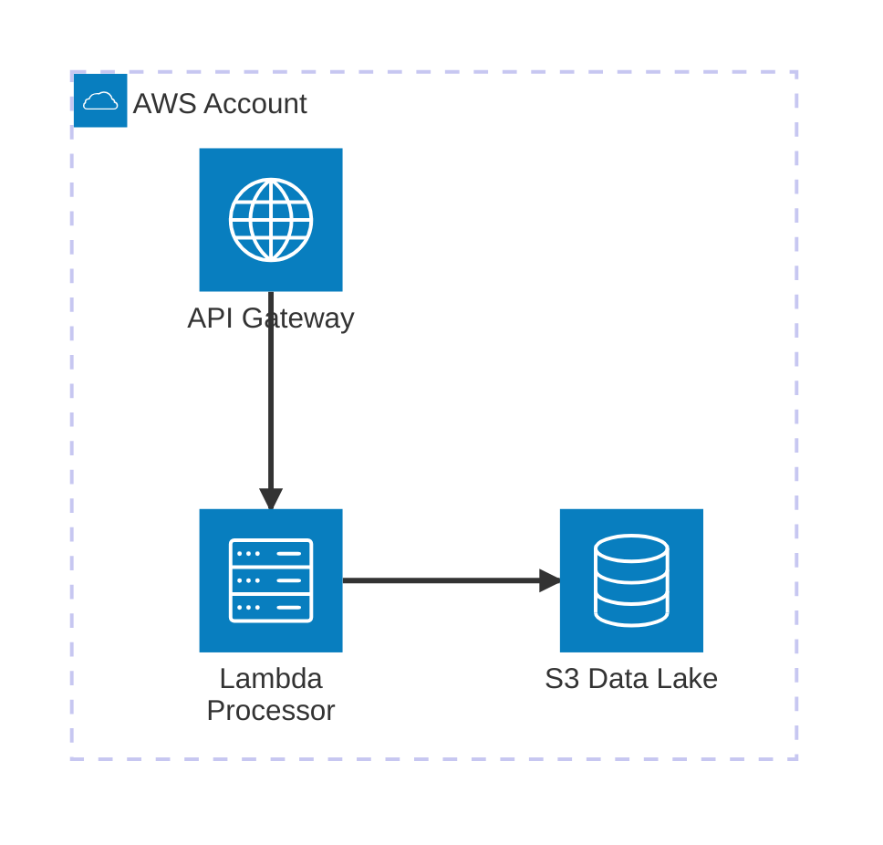

```mermaid
architecture-beta
    group vpc(cloud)[VPC]
        group public(internet)[Public Subnet] in vpc
            service alb(logos:aws)[Load Balancer] in public
        group private(server)[Private Subnet] in vpc
            service ecs(logos:aws-ec2)[ECS Cluster] in private
            service rds(logos:aws-rds)[Database] in private

    alb:B --> T:ecs
    ecs:R --> L:rds
```

# Blog Authoring Guide

This steering document accelerates the creation of new blog posts for the fnjoin.com static blog.

## Content Structure Overview

The blog uses a structured content directory with the following organization:

```
content/
├── authors/          # Author profiles (markdown files)
├── post/            # Blog posts (markdown files)
├── page/            # Static pages
├── drafts/          # Draft posts
├── assets/          # Shared assets
└── img/             # Images organized by post
```

## Post Creation Workflow

### 1. File Naming Convention

Posts follow the pattern: `YYYY-MM-DD-slug.md`

Examples:

-   `2024-03-04-projen-pdk-nx.md`
-   `2024-05-12-the-reasons-i-dont-write.md`
-   `2021-08-27-show-deployments.md`

### 2. Required Frontmatter Structure

Every post must include this frontmatter at the top:

```yaml
---
author: Author Name
title: "Post Title"
subtitle: Optional subtitle for additional context
excerpt: >
    SEO-optimized description (under 160 chars) describing what readers will learn.
    Use multi-line YAML for longer excerpts to improve readability.
date: YYYY-MM-DD
coverImage:
    imageSrc: /img/post-slug/cover.webp
    caption: Image description for accessibility
ogImage:
    url: /img/post-slug/social-share.webp
tags: ["tag1", "tag2", "tag3"]
---
```

#### Frontmatter Field Guide

**Required Fields:**

-   `title`: The main post title (used in `<title>` tag and `<h1>`)
-   `author`: Must match an author file in `content/authors/`
-   `date`: Publication date in YYYY-MM-DD format
-   `tags`: Array of relevant tags for categorization

**SEO & Social Media Fields:**

-   `excerpt`: **Critical for SEO** - Used as meta description and OpenGraph description

    -   Must be under 160 characters for optimal search results
    -   Should describe what readers will learn, not just what the post is about
    -   Match the post's tone (conversational for discovery posts, technical for tutorials)
    -   Examples:
        -   ✅ "Learn why git becomes your lifeline when AI writes most of your code"
        -   ❌ "This post is about using git with AI coding tools"

-   `subtitle`: Optional tagline that appears under the title
    -   Used for additional context or compelling hook
    -   Often more specific than the title
    -   Example: "Add user ID, session ID, and request ID to every log—AI can now trace any bug"

**Image Fields:**

-   `coverImage`: Primary article image displayed in post and previews

    -   `imageSrc`: Path to image file (preferably WebP format)
    -   `caption`: Alt text for accessibility and image description

-   `ogImage`: **Dedicated social sharing image** (takes priority over coverImage)
    -   `url`: Path to optimized social media image
    -   **Optimal dimensions**: 1200x630 pixels (1.91:1 aspect ratio)
    -   Used for Facebook, Twitter, LinkedIn previews
    -   Should be designed specifically for social sharing

**Image Priority for Social Sharing:**

1. `ogImage.url` (if present) - purpose-built for social media
2. `coverImage.imageSrc` (fallback) - article display image
3. No image (if neither exists)

**Optional Fields:**

-   `draft`: Set to `true` to exclude from published site
-   Custom fields for specific post types (add as needed)

#### SEO Implementation Details

The frontmatter automatically generates these HTML meta tags:

```html
<!-- From title -->
<title>Post Title | Join Function</title>

<!-- From excerpt -->
<meta name="description" content="Excerpt content here" />

<!-- Required OpenGraph tags (og:title, og:type, og:image, og:url) -->
<meta property="og:title" content="Post Title | Join Function" />
<meta property="og:type" content="article" />
<meta
    property="og:image"
    content="https://fnjoin.com/img/post-slug/social.webp"
/>
<meta property="og:url" content="https://fnjoin.com/post/post-slug/" />

<!-- Canonical URL (with trailing slash) -->
<link rel="canonical" href="https://fnjoin.com/post/post-slug/" />
```

**OpenGraph Requirements:**

-   All pages include the four required OpenGraph tags: `og:title`, `og:type`, `og:image`, `og:url`
-   Posts use `type: "article"`, other pages use `type: "website"`
-   Default fallback image (`/fnjoin.png`) when no custom image exists
-   Images should be 1200x630px for optimal social sharing

#### Excerpt Writing Guidelines

**Match the post's tone:**

-   Discovery posts: "Discover why...", "Learn how...", "Stop doing X and start..."
-   Technical tutorials: "Build a system that...", "Configure X to achieve Y..."
-   Experience posts: "Transform X into Y using...", "Turn your Z problem into..."

**Focus on learning outcomes:**

-   What will readers be able to do after reading?
-   What specific problem does this solve?
-   What insight or technique will they gain?

**Examples by post type:**

_AI Coding Tips (conversational):_

```yaml
excerpt: Stop arguing with chatbots about TypeScript vs JavaScript. Learn how to scaffold projects before AI writes application code, turning your workspace structure into the perfect prompt.
```

_Technical Tutorial (direct):_

```yaml
excerpt: Build a Kubernetes controller that automatically creates MySQL databases with StatefulSets, Services, and Secrets. Learn how controllers subscribe to API events and manage resource lifecycles.
```

_Infrastructure Guide (practical):_

```yaml
excerpt: Set up remote development with VS Code's SSH plugin and automatic port forwarding. Learn how to use AWS CDK to create and delete EC2 development environments with encrypted storage.
```

A general recommendation today is to keep your page description between 110 and 160 characters, although Google can sometimes show longer snippets.

### 3. Author Management

Authors are defined in `content/authors/[username].md`:

```yaml
---
picture: /assets/author-photo.png
name: Full Name
bio: Brief professional bio
---
```

Current authors:

-   `acowan.md` - Archie Cowan
-   `smalik.md` - Salman Malik

## Content Style Guidelines

### Voice & Tone (from style.md)

-   **Enthusiastic without being annoying**: Share discoveries, don't preach
-   **Self-deprecating**: Show mistakes and learning process
-   **Conversational**: Write like talking to a colleague over coffee
-   **Humble expertise**: You know things, but you're still figuring it out

### Structure: AIDA Framework

1. **Attention** (1-3 sentences): Hook with relatable pain or surprising statement
2. **Interest** (2-4 paragraphs): Explain why the problem exists, reveal underlying principle
3. **Desire** (3-6 paragraphs): Paint before/after picture with specific details
4. **Action** (2-4 paragraphs): Tell them exactly what to do next

### Content Elements

-   **Specific details**: Include actual numbers, tool names, scenarios
-   **Code examples**: Use proper markdown code blocks with language hints
-   **Metaphors**: Ground in familiar concepts (IaC, cattle vs pets)
-   **Show, don't tell**: Include examples, not just descriptions

### Cliches to avoid

Avoid using these overused phrases:

-   Here's the thing nobody tells you about ...
-   Here's the kicker ...
-   You won't believe ...
-   This one weird trick ...
-   The secret that [industry] doesn't want you to know ...

**Why to avoid**: These phrases have become clickbait cliches that make content sound sensational rather than authentic. Use more natural, conversational transitions instead.

## Technical Content Patterns

### URL Convention

**Important**: All URLs use the apex domain `fnjoin.com` without the `www` subdomain to avoid 301 redirects. This applies to:

-   Sitemap URLs
-   OpenGraph URLs (`og:url`)
-   Canonical URLs
-   RSS feed URLs
-   All internal references

The site redirects `www.fnjoin.com` to `fnjoin.com`, so using the apex domain directly prevents unnecessary redirects that can impact SEO and page load times.

### Tag Page SEO Strategy

Tag pages are automatically marked with `noindex` until they have custom content to prevent thin content issues:

-   **Auto-generated tag pages**: `robots: { index: false, follow: true }` - Just lists of posts
-   **Custom tag pages**: `robots: { index: true, follow: true }` - Have dedicated content in `content/tag/tagname.md`

To create indexable tag content:

1. Create `content/tag/your-tag-name.md` with frontmatter and content
2. The tag page will automatically become indexable
3. Custom content appears above the post list

This prevents search engines from seeing auto-generated tag pages as thin content while allowing rich tag pages to be indexed.

### Code Blocks

Use fenced code blocks with language specification:

```typescript
// TypeScript example
const project = new MonorepoTsProject({
    name: "my-project",
    packageManager: NodePackageManager.PNPM,
});
```

### Figures and Captions

For complex examples, use figure-fence blocks with references:

````markdown
:::figure-fence{id="code:bootstrap" title="Project Bootstrap Command" caption="Initial setup command for creating a new project with PDK"}

```bash
mkdir prototype-with-pdk
npm install -g pnpm
```

:::

Later in the text, reference it with: :ref{id="code:bootstrap"}
````

**Frontmatter setup required:**

```yaml
figurens:
    code: Code Example
    arch: Architecture
    flow: Data Flow
```

````

### Inline Callouts

Use special callout syntax for emphasis:

```markdown
:::inline-callout
Key insight or principle goes here
:::

:::margin-note
Additional context or tangential information
:::
````

## Image Management

### Directory Structure

Images are organized by post slug:

```
content/img/
├── post-slug/
│   ├── cover.webp
│   ├── diagram-1.png
│   └── screenshot-2.png
```

### Image Guidelines

-   Use WebP format for covers when possible
-   Include descriptive alt text in captions
-   Optimize images for web (reasonable file sizes)
-   Use consistent naming: `cover.webp`, `diagram-1.png`, etc.

## Draft Workflow

### Using Drafts Directory

1. Create new posts in `content/drafts/` first
2. Use same naming convention and frontmatter
3. Move to `content/post/` when ready to publish

### Draft Frontmatter

Add draft status to frontmatter:

```yaml
---
draft: true
author: Author Name
title: "Draft Post Title"
# ... rest of frontmatter
---
```

## Common Post Types

### Technical Tutorial Posts

Structure:

1. **Problem statement**: What we're solving
2. **Prerequisites**: What readers need
3. **Step-by-step walkthrough**: Numbered sections
4. **Code examples**: Working, complete examples
5. **Next steps**: What to explore further

Example tags: `["tutorial", "aws", "kubernetes", "java"]`

### Discovery/Experience Posts

Structure:

1. **The frustration**: Specific, relatable problem
2. **The insight**: What you discovered
3. **The transformation**: Before/after with specifics
4. **The takeaway**: What others can apply

Example tags: `["experience", "tools", "productivity"]`

### Tool/Library Reviews

Structure:

1. **Context**: Why you needed this tool
2. **Evaluation**: What you tested, how
3. **Results**: Specific outcomes, metrics
4. **Recommendation**: When to use, when not to

Example tags: `["review", "tools", "comparison"]`

## Publishing Checklist

Before moving from drafts to posts:

-   [ ] **Frontmatter complete and properly formatted**
    -   [ ] Required fields: title, author, date, tags
    -   [ ] Excerpt written (under 160 chars, describes what readers learn)
    -   [ ] Subtitle added if helpful for context
    -   [ ] Author exists in `content/authors/`
-   [ ] **Images optimized and configured**
    -   [ ] Cover image exists and is optimized
    -   [ ] OG image created (1200x630px) for social sharing if needed
    -   [ ] Image captions include proper alt text
-   [ ] **Content quality checks**
    -   [ ] All code examples tested and working
    -   [ ] Links verified and working
    -   [ ] Post follows AIDA structure
    -   [ ] Voice matches style guidelines (conversational, humble)
    -   [ ] Specific details included (numbers, tool names, scenarios)
    -   [ ] Clear call-to-action at the end
-   [ ] **SEO and discoverability**
    -   [ ] Tags are relevant and consistent with existing posts
    -   [ ] Excerpt optimized for search results and social sharing
    -   [ ] Title is compelling and descriptive

## Quick Start Commands

Create a new post:

```bash
# Create the post file
touch "content/drafts/$(date +%Y-%m-%d)-your-post-slug.md"

# Create image directory
mkdir -p "content/img/your-post-slug"
```

Move draft to published:

```bash
mv "content/drafts/YYYY-MM-DD-post-slug.md" "content/post/"
```

## Content Ideas Tracking

Keep a running list of post ideas based on:

-   Problems you solved recently
-   Tools you discovered
-   Mistakes you made and learned from
-   Questions colleagues ask repeatedly
-   Interesting patterns you noticed

Remember: The best posts come from real experiences, not theoretical knowledge.

## Mermaid Diagrams

### Overview

This blog supports Mermaid diagrams with enhanced AWS icon support. The implementation includes custom icon packs that work in controlled environments (this blog) but may fall back to basic icons on platforms like GitHub.

### Basic Usage

Use standard Mermaid syntax in fenced code blocks:

````markdown

````

### Architecture Diagrams with AWS Icons

The blog includes AWS icon support through the `logos` and `simple-icons` icon packs:

````markdown

````

### Available Icon Packs

**Logos Icon Pack** (`logos:icon-name`):

-   **AWS Services**: `logos:aws`, `logos:aws-s3`, `logos:aws-lambda`, `logos:aws-ec2`, `logos:aws-rds`, `logos:aws-api-gateway`, `logos:aws-cloudfront`, `logos:aws-dynamodb`, `logos:aws-iam`
-   **Other Tech**: `logos:docker`, `logos:kubernetes`, `logos:react`, `logos:typescript`, `logos:nodejs`, `logos:python`, `logos:java`
-   **Full list**: Browse at [iconify.design/icon-sets/logos](https://iconify.design/icon-sets/logos/)

**Simple Icons Pack** (`simple-icons:icon-name`):

-   **Platforms**: `simple-icons:github`, `simple-icons:gitlab`, `simple-icons:docker`, `simple-icons:kubernetes`
-   **Languages**: `simple-icons:javascript`, `simple-icons:typescript`, `simple-icons:python`, `simple-icons:java`, `simple-icons:go`
-   **Full list**: Browse at [iconify.design/icon-sets/simple-icons](https://iconify.design/icon-sets/simple-icons/)

### Built-in Mermaid Icons (Always Available)

For maximum compatibility across platforms, use Mermaid's built-in icons:

-   `cloud` - AWS accounts, cloud services
-   `database` - RDS, DynamoDB, S3
-   `server` - EC2, Lambda, ECS
-   `internet` - API Gateway, CloudFront, Load Balancers
-   `disk` - Storage services

### Icon Reference Quick Guide

| Service Type  | Custom Icon             | Built-in Fallback | Usage                                             |
| ------------- | ----------------------- | ----------------- | ------------------------------------------------- |
| AWS Account   | `logos:aws`             | `cloud`           | `service aws(logos:aws)[AWS Account]`             |
| S3 Bucket     | `logos:aws-s3`          | `database`        | `service s3(logos:aws-s3)[S3 Bucket]`             |
| Lambda        | `logos:aws-lambda`      | `server`          | `service lambda(logos:aws-lambda)[Lambda]`        |
| EC2           | `logos:aws-ec2`         | `server`          | `service ec2(logos:aws-ec2)[EC2 Instance]`        |
| RDS           | `logos:aws-rds`         | `database`        | `service rds(logos:aws-rds)[Database]`            |
| API Gateway   | `logos:aws-api-gateway` | `internet`        | `service api(logos:aws-api-gateway)[API Gateway]` |
| Load Balancer | `logos:aws`             | `internet`        | `service alb(logos:aws)[Load Balancer]`           |

### Best Practices

1. **Always provide fallbacks**: Design diagrams that work with built-in icons
2. **Test across platforms**: Custom icons work here but may not render on GitHub
3. **Use semantic grouping**: Group related services even when icons aren't perfect
4. **Label clearly**: Good labels matter more than perfect icons

### Platform Compatibility

-   ✅ **This blog**: Full AWS icon support with custom icon packs
-   ❌ **GitHub/GitLab**: Custom icons fall back to question marks - use built-in icons
-   ⚠️ **Other platforms**: Mixed results - test before relying on custom icons

### Hybrid Approach Example

Create diagrams that work everywhere by using built-in icons with clear labels:

````markdown

````

### Finding More Icons

**Icon Search Resources:**

-   **Iconify Icon Sets**: [iconify.design/icon-sets](https://iconify.design/icon-sets/) - Browse all available icon packs
-   **Logos Collection**: [iconify.design/icon-sets/logos](https://iconify.design/icon-sets/logos/) - Tech company and service logos
-   **Simple Icons**: [iconify.design/icon-sets/simple-icons](https://iconify.design/icon-sets/simple-icons/) - Brand icons for popular services
-   **Icon Search**: [icones.js.org](https://icones.js.org/) - Search across all Iconify icon sets

**Usage Pattern**: `pack-name:icon-name`

-   Example: `logos:aws-s3`, `simple-icons:docker`, `logos:kubernetes`

### Technical Implementation

The blog's `MermaidDiagram` component automatically registers these icon packs:

-   `@iconify-json/logos` - Tech logos and service icons
-   `@iconify-json/simple-icons` - Brand and platform icons

Icons are loaded on-demand when diagrams are rendered, with graceful fallback to built-in icons if loading fails.
