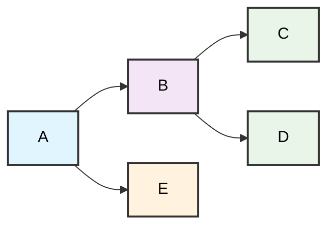

A project I was on a couple years ago nearly brought back all my repetitive strain injuries just because of the build system.

There were multiple modules. They needed to build in a particular order. Worse, I kept forgetting and testing against old builds of those modules which meant I had to start over repeatedly. _Somebody_ didn't plan ahead and I almost couldn't hold my toothbrush at the end of the day.

:::margin-note
To be clear, I didn't plan ahead.
:::

This experience motivated me to go at least ankle deep in smart build tools so that I could put some distance between me and tendinitis. But, RSI relief wasn't the only benefit. Turned out smart build tools are very helpful with AI assisted coding too!

## Smart builds as AI code reviewers

Your build system becomes your most reliable code reviewer when you let it fail fast and fail loud. While you're focused on getting the AI to write better code, your build pipeline is quietly catching the catastrophes that would bite you later.

The AI writes code that compiles. It might even write tests that pass. But does it handle the edge cases your linter catches? Does it follow your team's architectural constraints? Does it break when deployed to your staging environment?

A smart build system knows. It will also speed up your iterations.

## From manual dependency tracking to automated intelligence

Before I made the switch, I would lose so much time building modules that didn't need building and forgetting builds I desperately needed. The cognitive load added to troubleshooting changes was draining. Didn't I just fix that problem? Is my new code even called at all? Oh, I missed it in the build.

After I brought smart builds into my projects, so many aspects of my workflow were simplified. I just used the build targets to build and deploy. The build system determines what needs to be built. Modules that changes don't affect can reuse their build outputs without rerunning compilation, testing, and packaging steps. Now my obsession with using discrete modules in a monorepo stopped hurting me and started helping me.

:::figure-fence{id="arch:dependency-graph" title="Example Monorepo Package Dependency Structure" caption="Module dependencies showing how changes propagate through the system. When D changes, it affects B and A but not C and E."}

:::

:ref{id="arch:dependency-graph"} shows a relatively simple module structure but it created all this complexity that I no longer have to keep track of in my head:

-   When D changes, you know there could be impacts to B and A but not C and E.
-   When E changes, it could impact A but not B, C, D.
-   When A changes, it only impacts A.
-   When C, D, and E change, every module is affected.

As AI coding assistants came on the scene, I found smart builds incredibly helpful here too.

## Running builds in the AI feedback loop

A big shift for me this year was when I began leaning on my AI coding assistant to run builds as I iterated my software.

I wrote about the prompt below in [A failing test is worth a thousand prompts](/post/2025-12-25-a-failing-test-is-worth-a-thousand-prompts/).

> One of my favorite ways to prompt my AI assistant is _run the test suite and remediate any test failures_. It is efficient with keystrokes, context window usage, and how often I need to reprompt to get good results.

There is a more general version of this which is _run the build for my infrastructure automation and remediate test failures, linting errors, and security warnings_. I let my build system take care of all the details. I don't need to fill up my context window for the assistant with tons of instructions. Mainly I just need to have rules/steering that bias the assistant to run `pnpm exec nx run deploy:build` instead of the command that would only concern itself with a compilation step for a single module like `pnpm run build` from that module's directory.

The time savings is relatively small on a per build basis but I run this so much more often now that it's so easy, the savings stack up surprisingly fast–especially as I miss fewer defects caught by my entire pipeline. Perhaps just as importantly, the AI assistant gets this feedback as well and remediates findings in a tighter loop.

:::margin-note
TIL: I haven't been using my linter to express rules of my technical architecture well. It seems like I could be using it to ensure that, for example, my React code doesn't directly make remote calls with `fetch` or `axios` and instead uses a service layer. Probably a future post!
:::

## Getting started with smart build tools

The smart build tool I like to use right now is [Nx](https://nx.dev/). But, there are a handful of others. Turborepo, Lerna, and Rush are others for example. Nx skews more polyglot which helps me a lot and I'm able to set it up quickly with my [scaffolding mechanism](/post/2025-12-21-code-your-own-scaffolding-first/). I rarely just work in Typescript. When I need to simplify but still maintain some benefits from a modular monorepo structure, pnpm workspaces are super helpful too. I used pnpm for the final draft of my [serverless AI gateway sample](https://github.com/aws-samples/sample-serverless-ai-gateway/tree/main) repository.

The three main benefits I've found when combining smart builds with AI coding:

1. **Build systems catch AI mistakes automatically** - Your linter, tests, and compilation steps become an extra code reviewer that never gets tired
2. **Smart builds eliminate cognitive overhead of dependency management** - No more manually tracking what needs to be rebuilt when you change something
3. **AI assistants can run builds and fix issues in a tight loop** - Feed build failures directly back to the AI for faster iteration

Thank you for reading and give some of these concepts a try in your next project!
