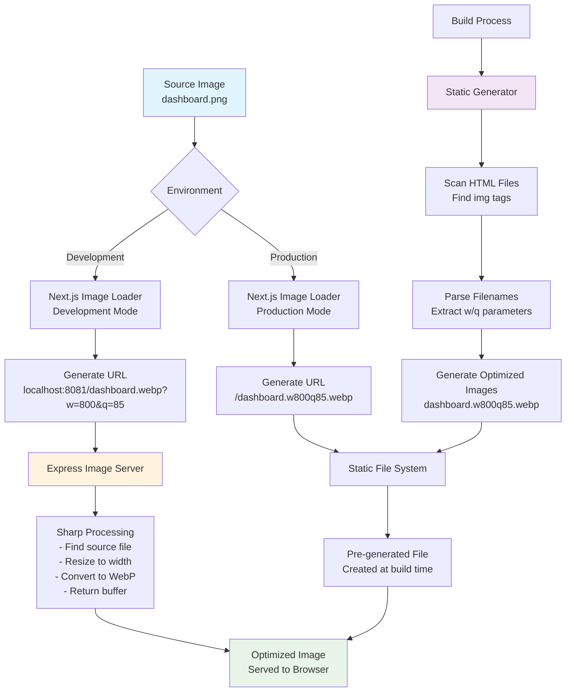

I discovered something that changed how I document solutions: when I solve something well, I have my AI assistant write a blog post about it. Not for publishing—for replicating.

This builds on yesterday's post about [keeping your working memory intact](/post/2025-12-28-keep-dependencies-in-workspace/). Instead of losing clever solutions in the depths of one codebase, I create reusable implementation guides that I can reference anywhere.

The example in :ref{id="article:imageserver"} shows something I built for this blog that I think is kind of clever. I wanted responsive images, WebP formatting, and a system that worked for static websites where everything gets prerendered. I didn't want to run an image server on the Internet, but I didn't mind running one while writing.

So I created this dual-mode approach that really works well.

The prompt I used to create the article is below.

:::figure-fence{id="article:imageserver" title="Example How to Article Generated by AI" caption="An article generated by AI about my image serving module for this blog." stylePreset="elevated" }

## Hybrid Image Optimization: Development Server with Static Generation

This guide demonstrates a two-phase image optimization system that provides fast development iteration while generating optimized static assets for production deployment.

### Benefits

**Development Experience**

-   Add images in any format (PNG, JPG, TIFF) without manual conversion
-   Instant preview of optimized images during development
-   No build delays when adding or modifying images
-   Format-agnostic filename matching

**Production Performance**

-   Pre-generated WebP images with exact dimensions
-   Zero runtime image processing overhead
-   Optimal file sizes with configurable quality settings
-   Responsive image delivery based on device requirements

**Responsive Web Design**

-   Automatic generation of device-specific image sizes
-   Perfect sizing (750px container gets 750px image, not 800px scaled down)
-   Bandwidth optimization for mobile devices
-   Quality control per image type (screenshots vs photos)

### Architecture Overview

The system operates in two phases:

1. **Development Phase**: Express server provides on-demand image transformation
2. **Build Phase**: Static generator pre-creates optimized images by parsing HTML output

URL transformation differs by environment:

-   Development: `http://localhost:8081/image.webp?w=800&q=85`
-   Production: `/image.w800q85.webp`



### Step 1: Create the Development Image Server

Create an Express server that handles image transformation requests:

```typescript
import fs from "fs/promises";
import path from "path";
import express from "express";
import sharp from "sharp";
import yargs from "yargs";

async function main() {
    const argv = await yargs(hideBin(process.argv))
        .option("root-dir", { type: "string", demandOption: true })
        .option("port", { type: "number", default: 3000 })
        .option("quality", { type: "number", default: 85 })
        .option("default-width", { type: "number", default: 800 }).argv;

    const app = express();

    app.get("/*", async (req, res) => {
        const { w, q } = req.query;
        const width = parseInt(w as string, 10) || argv.defaultWidth;
        const quality = parseInt(q as string, 10) || argv.quality;

        const requestedPath = path.join(argv.rootDir, req.path);
        const dirPath = path.dirname(requestedPath);
        const baseName = path.basename(
            requestedPath,
            path.extname(requestedPath),
        );

        try {
            const dirFiles = await fs.readdir(dirPath);
            const matchingFiles = dirFiles.filter(
                (file) => path.basename(file, path.extname(file)) === baseName,
            );

            if (matchingFiles.length === 0) {
                return res.status(404).send("File not found");
            }

            const originalImagePath = path.join(dirPath, matchingFiles[0]);

            return await sharp(originalImagePath)
                .resize(width)
                .webp({ quality })
                .toBuffer()
                .then((data) => res.type("webp").send(data));
        } catch (err) {
            return res.status(404).send("Directory not found");
        }
    });

    app.listen(argv.port);
}
```

Key features:

-   **Format-agnostic matching**: Finds source images regardless of extension
-   **Query parameter control**: Width (`w`) and quality (`q`) via URL
-   **Sharp integration**: Handles resizing and WebP conversion

### Step 2: Create Development Image Loader

Create a Next.js image loader for development:

```typescript
// my-image-server-loader.ts
import * as path from "path";

export default function ImageLoader({ src, width, quality }: any) {
    quality = quality ?? 85;
    const ext = src.split(".").pop();
    const basename = path.basename(src, ext);
    const dirname = path.dirname(src);
    const outsrc = `${dirname === "." ? "" : dirname}/${basename}webp?w=${width}&q=${quality}`;
    return `http://localhost:8081${outsrc}`;
}
```

### Step 3: Create Production Image Loader

Create a loader that references pre-generated static files:

```typescript
// my-simple-loader.ts
import * as path from "path";
import { basePath } from "next.config";

export default function ImageLoader({ src, width, quality }: any) {
    quality = quality ?? 85;
    const ext = src.split(".").pop();
    const basename = path.basename(src, ext);
    const dirname = path.dirname(src);
    const outsrc =
        dirname + "/" + basename + "w" + width + "q" + quality + ".webp";
    return `${basePath ?? ""}${outsrc}`;
}
```

### Step 4: Configure Environment-Based Loader Switching

Configure Next.js to use different loaders based on environment:

```javascript
// next.config.js
module.exports = {
    images: {
        loader: "custom",
        loaderFile:
            process.env.NODE_ENV === "development"
                ? "./my-image-server-loader.ts"
                : "./my-simple-loader.ts",
    },
};
```

### Step 5: Create Static Image Generator

Build a tool that scans HTML output and generates optimized images:

```typescript
import fs from "fs";
import path from "path";
import { glob } from "glob";
import { JSDOM } from "jsdom";
import sharp, { FormatEnum } from "sharp";

async function processHtmlFiles(
    htmlDirectory,
    originDirectory,
    outputDirectory,
) {
    const htmlFiles = await glob.glob(`${htmlDirectory}/**/*.html`);

    for (const file of htmlFiles) {
        const htmlContent = fs.readFileSync(file, "utf-8");
        const dom = new JSDOM(htmlContent);
        const images = dom.window.document.querySelectorAll("img");

        for (const img of images) {
            const src = img.getAttribute("src");
            const srcset = img.getAttribute("srcset");

            const imageSources = new Set();
            if (src) imageSources.add(src);
            if (srcset) {
                srcset.split(",").forEach((part) => {
                    const srcInfo = part.trim().split(" ")[0];
                    imageSources.add(srcInfo);
                });
            }

            for (const source of imageSources) {
                await processImageSource(
                    source,
                    originDirectory,
                    outputDirectory,
                );
            }
        }
    }
}

async function processImageSource(source, originDirectory, outputDirectory) {
    const { dir, name } = path.parse(source);
    const match = name.match(/(.*?)\.w(\d+)q(\d+)$/);

    if (!match) {
        console.warn(`Invalid image name: ${name}`);
        return;
    }

    const format = path.extname(source).slice(1);
    const [, baseName, width, quality] = match;
    const originPath = path.join(originDirectory, dir, baseName);
    const outputPath = path.join(outputDirectory, source);

    // Find original file with any supported extension
    const originalFile = glob.sync(`${originPath}.{jpg,jpeg,png,webp}`)[0];
    if (!originalFile) {
        console.warn(`Original file not found for ${source}`);
        return;
    }

    // Skip if output already exists
    if (fs.existsSync(outputPath)) {
        return;
    }

    // Ensure output directory exists
    fs.mkdirSync(path.dirname(outputPath), { recursive: true });

    // Generate optimized image
    await sharp(originalFile)
        .resize(parseInt(width), null)
        .toFormat(format as keyof FormatEnum, { quality: parseInt(quality) })
        .toFile(outputPath);
}
```

Key features:

-   **HTML parsing**: Uses JSDOM to find all image references
-   **Filename parsing**: Extracts width and quality from encoded filenames
-   **Batch processing**: Handles both `src` and `srcset` attributes
-   **Skip existing**: Avoids regenerating existing files

### Step 6: Integrate into Build Process

Add the static generation to your build pipeline:

```json
{
    "scripts": {
        "build": "next build && next export",
        "postbuild": "static-website-image-gen --html-dir ./out --origin-dir ./content --target-dir ./out"
    }
}
```

### Usage

1. **Development**: Start the image server and Next.js development server

    ```bash
    image-server --port 8081 --root-dir ./content &
    npm run dev
    ```

2. **Production**: Build and generate static images

    ```bash
    npm run build
    npm run postbuild
    ```

3. **Adding Images**: Drop any image format into your content directory and reference normally:
    ```markdown
    
    ```

The system automatically handles format conversion, resizing, and optimization based on the requesting device and container size.

:::

I used a sequence of prompts to create this guide. Here's the first one.

> My image-server package does some interesting things to prepare images for my blog built with Next.js. Write an article in a markdown file for an audience of developers who might want to do something similar in another context.

The initial output missed the responsive pieces and the static build generation. The tone felt off too. So, this prompt provided the second iteration.

> Make sure to cover the responsive web design benefits this approach offers. Also cover how it generates images statically during builds. Write it as a step-by-step guide. State the benefits upfront, then provide the step-by-step guide. Don't take a bragging or boastful tone. Benefits and steps.

Then I realized diagrams would clarify the architecture.

> Can you include a Mermaid diagram in the overview?

Most IDEs render Mermaid diagrams now. Maybe in another post I'll explain how I render them from markdown in the blog.

The whole process entertains me with how effortless it becomes.

Now this "article" lives in a folder of guides I've requested from my assistant. When I want to implement something similar, I reference the file and ask my assistant to create a plan I can review. With Kiro specifically, I can use it to plan a new spec.

**Your next clever solution:** Don't let it disappear into the void. Ask your AI assistant to write a step-by-step implementation guide. Start with this prompt: "I built [describe your solution]. Write a developer guide that explains how to implement this approach in another project."

Watch how much faster you move when you can reference your own solutions instead of rebuilding from scratch every time.
