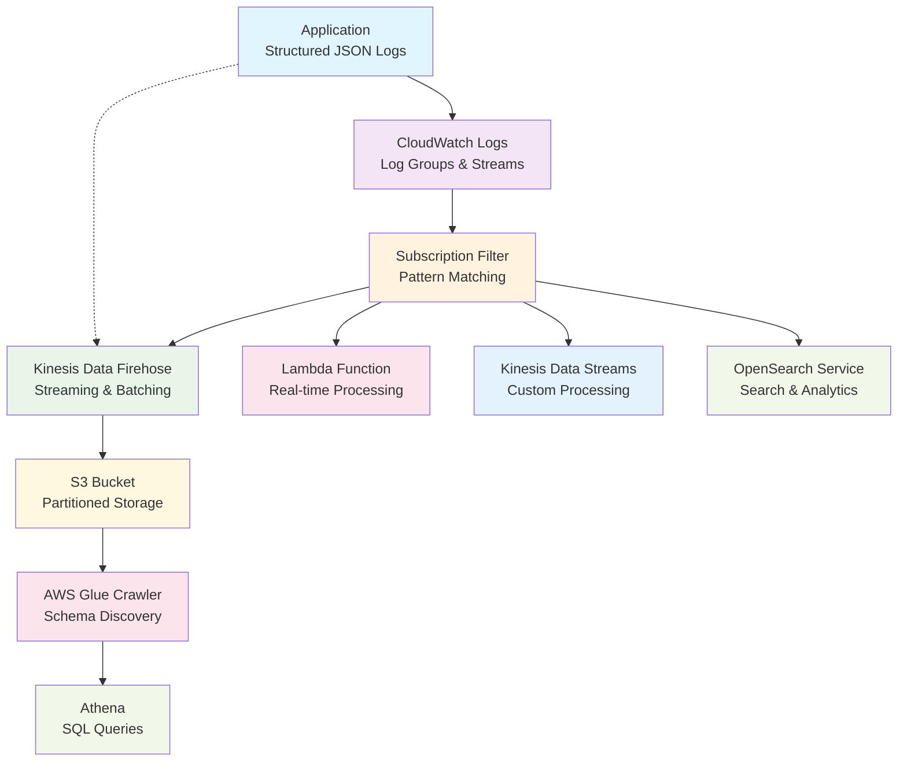
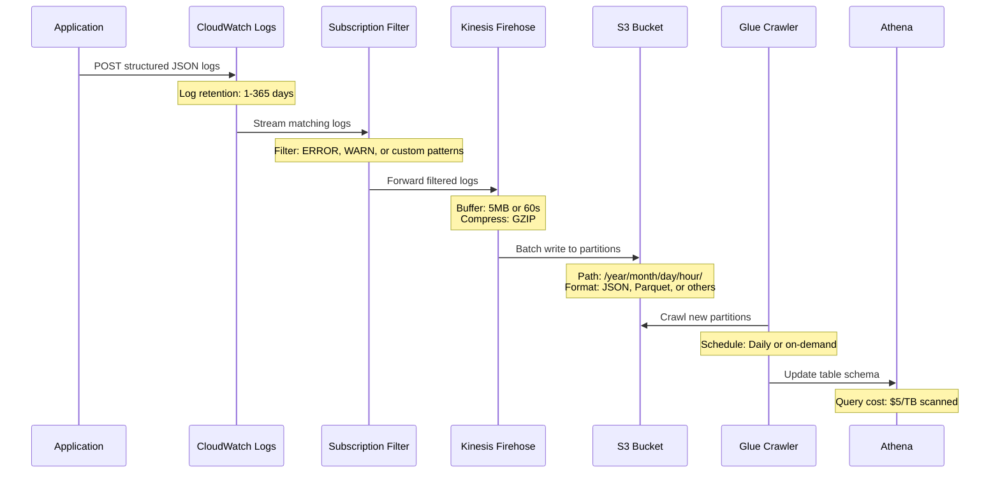
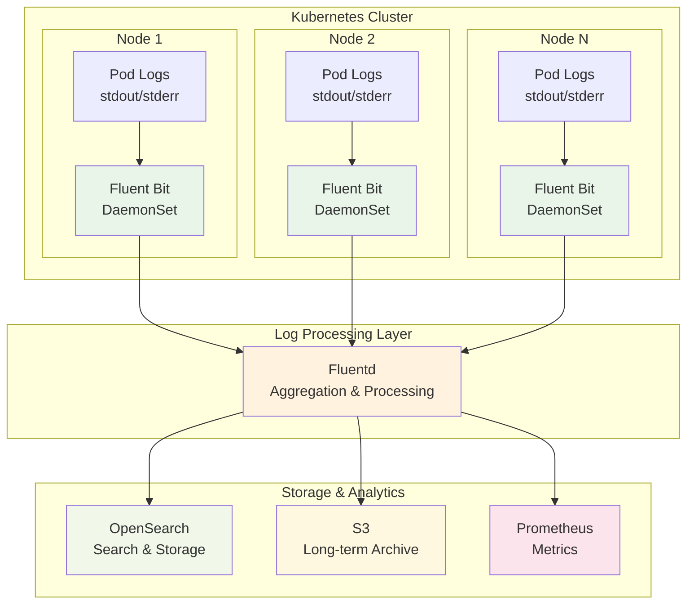
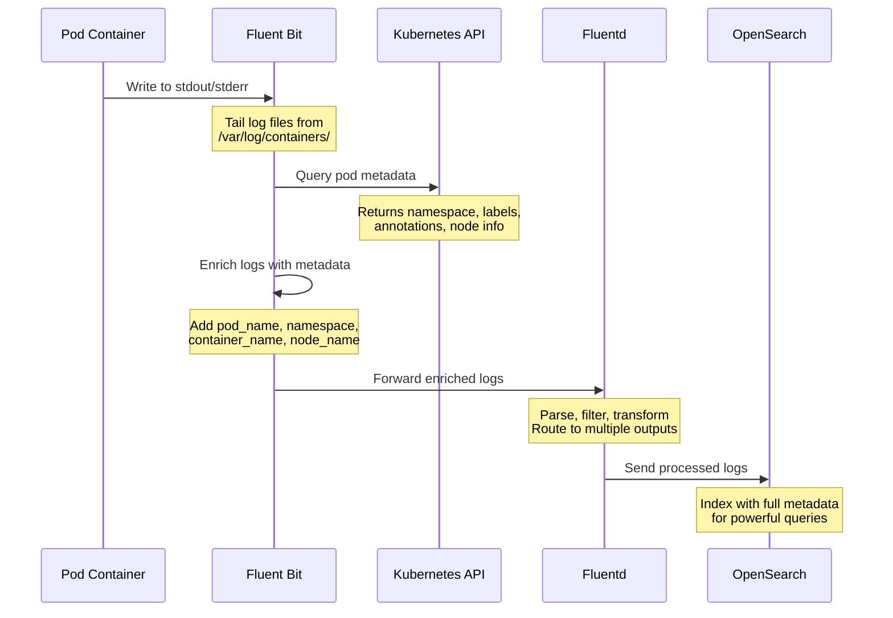

## Why unstructured logs fail

You have 1,000 requests per second, 10,000 log events per second, someone is on the phone with support claiming they're experiencing latency over 20 seconds before getting a 504 error from the website dashboard. What can you do to investigate?

With that volume of data, logs become a firehose of frustration. Impossible to eyeball like you might when developing locally. You desperately need some way to query all that information.

### Unstructured Logs

With unstructured logs, regular expressions and scripts might eventually find that user's logs. You tell your support colleague you'll get back to them in a couple hours (or days). You're thinking, there has to be a better way.

But with structured logs, you stop hunting and start querying.

### Structured Logs

With structured logs, you query your centralized log system with known information to find unique users who experienced HTTP 504 errors with greater than 20 seconds of latency.

```sql
SELECT DISTINCT user_id, COUNT(*) as error_count
FROM application_logs
WHERE status = 504
  AND duration > 20000  -- milliseconds
  AND dt >= CURRENT_DATE - INTERVAL '7 days'
GROUP BY user_id
ORDER BY error_count DESC;
```

Aha! You find a batch of users. Using the previous query in a SQL WITH clause, you join that with all user activity for those users and sort by user_id and timestamp to see what clues reveal themselves.

```sql
WITH affected_users AS (
  SELECT DISTINCT user_id
  FROM application_logs
  WHERE status = 504
    AND duration > 20000
    AND dt >= CURRENT_DATE - INTERVAL '7 days'
)
SELECT
  l.user_id,
  l.timestamp,
  l.method,
  l.path,
  l.status,
  l.duration,
  l.request_size,
  l.experiment_id,
  l.message
FROM application_logs l
JOIN affected_users au ON l.user_id = au.user_id
WHERE l.dt >= CURRENT_DATE - INTERVAL '7 days'
ORDER BY l.user_id, l.timestamp;
```

Aha again! You discover these users uploaded data an order of magnitude larger than other users and tried processing all of it at once. The log messages show they were opted into an A/B test allowing bigger file uploads. You tell your support colleague to suggest the customer use pagination instead of processing all records at once, and you open a ticket with the dev team that created the A/B experiment.

The customer gets unblocked, relieved to have a workaround and gratified to hear a ticket was filed. The dev team starts working on a fix thanks to clear information extracted from the logs.

Hours of hunting became minutes of querying.

## The bigger opportunity

But this is just the beginning. Every application you ever write is a telemetry source for the business and customer experience.

With structured logs, AI helps you formulate the right queries faster. Given a problem like "users are experiencing 504 errors" and your structured schema, AI quickly generates the SQL queries you need to investigate—turning hours of manual query writing into minutes of guided analysis.

Instead of spending time figuring out how to join tables and filter data, you describe the business problem and AI translates it into queries that reveal the answer. Your structured logs stop being debugging data and start becoming business intelligence.

Your prototype applications become working demonstrations of how customer data can drive business intelligence. Instead of just showing "here's a working feature," you're showing "here's how your application data reveals business insights."

From functional demos to analytical powerhouses.

## The Schema That Makes It Possible

Here are battle-tested fields that enable both debugging and AI analysis. This is my baseline for web applications—your needs may vary. Put these in your steering docs for your AI assistant so your code starts aligned to your desired schema.

### Core Log Fields

| Field       | Type     | Description                                                                                    |
| ----------- | -------- | ---------------------------------------------------------------------------------------------- |
| `dt`        | date     | Date in yyyy-mm-dd format. Used for partitioning.                                              |
| `timestamp` | datetime | Full timestamp in ISO 8601 format with milliseconds: `yyyy-mm-ddThh:mm:ss.sssZ`                |
| `log_level` | enum     | Documented log levels for consistent usage (debug, info, warn, error, fatal, or custom levels) |
| `message`   | string   | Generic text message describing the event                                                      |

### Identity & Tracing Fields

| Field                  | Type   | Description                                                                           |
| ---------------------- | ------ | ------------------------------------------------------------------------------------- |
| `user_id`              | uuid   | Durable user identifier across sessions, preferably UUID, tolerates handle changes    |
| `session_id`           | uuid   | UUID to represent a visit in your application or a working session                    |
| `request_id`           | uuid   | UUID to represent a single transaction                                                |
| `referring_request_id` | uuid   | UUID of the request or event that was the trigger for this event. Used in A/B testing |
| `correlation_id`       | uuid   | Alternative to request_id, often used in microservices                                |
| `trace_id`             | string | Distributed tracing identifier (OpenTelemetry standard)                               |
| `span_id`              | string | Span identifier for distributed tracing                                               |

### System & Environment Fields

| Field            | Type    | Description                                                             |
| ---------------- | ------- | ----------------------------------------------------------------------- |
| `source`         | string  | Name of the application receiving the event                             |
| `source_version` | string  | Version of the application, could be a git hash                         |
| `source_stack`   | array   | Stack of sources, e.g.: cdn, app name, mid tier app name, database name |
| `environment`    | string  | Environment name (dev, staging, prod)                                   |
| `hostname`       | string  | Server/container hostname where the log originated                      |
| `process_id`     | integer | Operating system process ID                                             |
| `thread_id`      | string  | Thread or process identifier for concurrent debugging                   |

### HTTP Request Fields

| Field                   | Type    | Description                                                   |
| ----------------------- | ------- | ------------------------------------------------------------- |
| `method`                | string  | HTTP method (GET, POST, PUT, DELETE, etc.)                    |
| `host`                  | string  | Server hostname handling the request                          |
| `path`                  | string  | URL path of the request                                       |
| `query_params`          | object  | URL query parameters (sanitized for sensitive data)           |
| `status`                | integer | HTTP status code (200, 404, 500, etc.)                        |
| `request_content_type`  | string  | MIME type of the request body                                 |
| `response_content_type` | string  | MIME type of the response (application/json, text/html, etc.) |
| `request_size`          | integer | Size of the request in bytes                                  |
| `response_size`         | integer | Size of the response in bytes                                 |
| `request_headers`       | object  | Important request headers (sanitized for sensitive data)      |
| `response_headers`      | object  | Important response headers                                    |
| `user_agent`            | string  | Browser/client user agent string                              |
| `referer`               | string  | HTTP referer header                                           |
| `remote_ip`             | string  | Client IP address (if privacy policies allow)                 |

### Performance & Metrics Fields

| Field      | Type  | Description                               |
| ---------- | ----- | ----------------------------------------- |
| `duration` | float | How long an operation took (milliseconds) |
| `ttfb`     | float | Time to first byte in milliseconds        |
| `ttlb`     | float | Time to last byte in milliseconds         |

### Error & Exception Fields

| Field               | Type   | Description                      |
| ------------------- | ------ | -------------------------------- |
| `error_code`        | string | Application-specific error code  |
| `error_type`        | string | Exception class name             |
| `stack_trace`       | string | Full stack trace for errors      |
| `error_fingerprint` | string | Hash for grouping similar errors |

### Security & Audit Fields

| Field          | Type   | Description                                      |
| -------------- | ------ | ------------------------------------------------ |
| `client_id`    | string | API client identifier                            |
| `auth_method`  | string | How user authenticated (oauth, jwt, basic, etc.) |
| `permissions`  | array  | User permissions/roles at time of request        |
| `geo_location` | string | Geographic location (country/region)             |

### Application-Specific Fields

Add your own domain-specific fields here based on your application's needs. Common examples include:

| Field             | Type   | Description                                             |
| ----------------- | ------ | ------------------------------------------------------- |
| `event_type`      | string | Human readable, unique identifier for the type of event |
| `feature_flag`    | array  | Which feature flags were active                         |
| `experiment_id`   | string | A/B test experiment identifier                          |
| `tenant_id`       | string | Multi-tenant application identifier                     |
| `organization_id` | string | Organization or workspace identifier                    |
| `api_version`     | string | API version used for the request                        |

## Implementation: Two Proven Starting Points

The schemas above provide your foundation. Here's a high-level starting point for infrastructure on AWS and Kubernetes.

## AWS Infrastructure for Structured Logs

Once you have structured logs, you need infrastructure to collect, store, and query them at scale. AWS provides a complete pipeline for this.

#### A Log Pipeline Architecture

:::figure-fence{id="arch:aws-pipeline" title="AWS Log Pipeline Architecture" caption="CloudWatch Logs subscription filters can route to different destinations based on log patterns - Kinesis Data Firehose for long-term analytics, Lambda for real-time processing, Kinesis Data Streams for custom processing pipelines, or OpenSearch Service for immediate search and dashboards."}



:::

:ref{id="arch:aws-pipeline"} shows the multiple routing options available. Applications can also send logs directly to Kinesis Data Firehose (dotted line), bypassing CloudWatch Logs entirely. This reduces latency and CloudWatch costs but loses CloudWatch's near real-time search and monitoring features.

#### Data Flow with Technical Details

:::figure-fence{id="flow:aws-sequence" title="AWS Data Flow with Technical Details" caption="Shows the technical details of how data moves through the pipeline with timing, compression, partitioning, and cost information."}



:::

CloudWatch Logs subscription filters let you specify patterns—only logs matching your criteria get streamed to Firehose. This saves costs and cuts noise.

Firehose automatically batches and compresses logs before storing them in S3, partitioned by date for efficient querying. A Glue crawler runs periodically to discover new partitions and update the schema.

An alternate path skips CloudWatch Logs and sends structured logs directly to Firehose using the AWS SDK. This eliminates the subscription filter step, reduces both latency and CloudWatch costs, and provides economical long-term storage in S3—but you miss CloudWatch Insights' observability features.

Then you query with standard SQL in Athena. :ref{id="flow:aws-sequence"} shows the complete technical flow.

#### Going Deeper

This barely scratches the surface. There are ways to modulate this for organizations big and small.

Here are your documentation starting points:

-   [Amazon CloudWatch Logs](https://docs.aws.amazon.com/AmazonCloudWatch/latest/logs/) - Log collection and subscription filters
-   [CloudWatch Logs Subscription Filters](https://docs.aws.amazon.com/AmazonCloudWatch/latest/logs/SubscriptionFilters.html) - Route log data to Kinesis Data Firehose, Lambda, and other services
-   [Amazon Kinesis Data Firehose](https://docs.aws.amazon.com/firehose/) - Streaming data delivery service
-   [Amazon S3](https://docs.aws.amazon.com/s3/) - Object storage with lifecycle management
-   [AWS Glue](https://docs.aws.amazon.com/glue/) - Data catalog and ETL service
-   [Amazon Athena](https://docs.aws.amazon.com/athena/) - Serverless query service

### Kubernetes Infrastructure for Structured Logs

In Kubernetes environments, Fluent Bit and Fluentd provide a powerful starting point for collecting and processing structured logs.

#### The Kubernetes Log Pipeline Architecture

:::figure-fence{id="arch:k8s-pipeline" title="Kubernetes Log Pipeline Architecture" caption="Fluent Bit runs as a DaemonSet on every Kubernetes node, efficiently collecting logs from all pods and enriching them with Kubernetes metadata like pod names, namespaces, and labels. Fluentd acts as a centralized aggregation layer."}



:::

#### Data Flow with Kubernetes Metadata Enrichment

:::figure-fence{id="flow:k8s-sequence" title="Kubernetes Data Flow with Metadata Enrichment" caption="Shows how logs get enriched with pod metadata from the Kubernetes API, including namespace, labels, annotations, and node information."}



:::

:ref{id="arch:k8s-pipeline"} shows the overall architecture, while :ref{id="flow:k8s-sequence"} details the metadata enrichment process.

**Fluent Bit** runs as a DaemonSet on every Kubernetes node, efficiently collecting logs from all pods and enriching them with Kubernetes metadata like pod names, namespaces, and labels.

**Fluentd** acts as a centralized aggregation layer, receiving logs from all Fluent Bit instances, applying complex processing rules, and routing to multiple destinations.

Lightweight collection, centralized control.

**Key advantages in Kubernetes:**

-   **Automatic discovery** - No configuration needed for new pods
-   **Metadata enrichment** - Logs include pod, namespace, and node context
-   **Resource efficiency** - Fluent Bit's lightweight footprint per node
-   **Flexible routing** - Send different log types to different destinations

**Official Documentation:**

-   [Fluent Bit](https://fluentbit.io/) - Lightweight log processor and forwarder
-   [Fluentd](https://www.fluentd.org/) - Open source data collector for unified logging
-   [Kubernetes Logging Architecture](https://kubernetes.io/docs/concepts/cluster-administration/logging/) - Official Kubernetes logging concepts

## Start Building

The schemas are defined. The infrastructure patterns are proven. Now it's time to implement structured logging in your applications.

Stop struggling, start structuring.

**Start with the core identity fields**: `user_id`, `session_id`, and `request_id`. Add these to every log entry in your next prototype. When you can trace a user's complete journey through your application with a single SQL query, you'll grasp the transformation.

**For a partial implementation example**, check out the [AWS Serverless AI Gateway sample](https://github.com/aws-samples/sample-serverless-ai-gateway)—it includes infrastructure as code for structured logging with CloudWatch, Firehose, and Athena. Just one way to do it, but a working reference implementation using AWS CDK that you can adapt.

Your applications already generate telemetry. Structure it strategically, and watch debugging transform from regex hunting to SQL querying.

From chaos to clarity, from hunting to querying.
