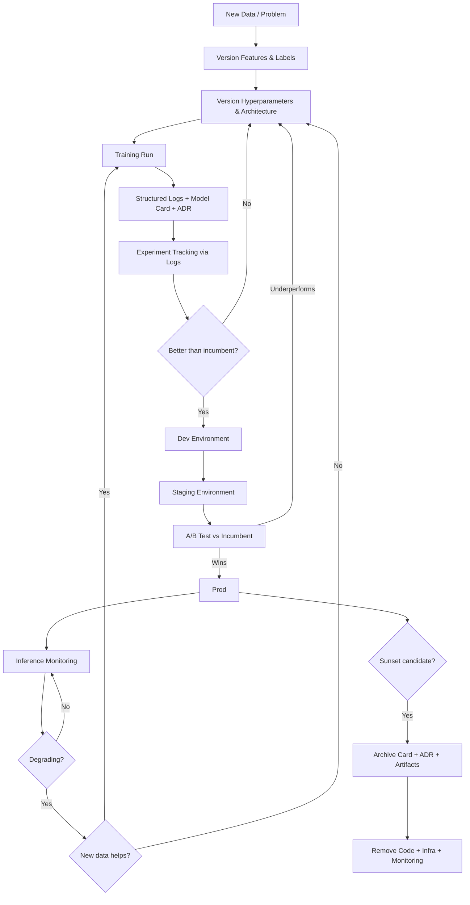

I was building models on nights and weekends to automate something, and I kept losing track of where I left off. What did I try last Saturday? Why did I reject that feature set? Which hyperparameters actually moved the needle two weeks ago?

Turns out my AI assistant had the same problem. Between sessions, it forgot everything — what we'd tried, what worked, what didn't, what to focus on next. We were both starting from scratch every time I opened my laptop Saturday morning.

My process wasn't helping. I was doing what felt natural: visualizing data, eyeballing loss curves, making judgment calls that lived entirely in my head. Classic human-in-the-loop ML development. But that process assumes the human remembers the loop. On a nights-and-weekends schedule after a busy work week, I absolutely did not.

And even when I did remember, my AI assistant couldn't see my visualizations. Couldn't read my intuition. Couldn't pick up where we left off because "where we left off" was a mental model that existed nowhere except my increasingly unreliable memory.

Around the same time, I was preparing a talk on [Deming's 14 Points of Management](https://deming.org/explore/fourteen-points/). Point three hit me right between the eyes: cease dependence on inspection to achieve quality — build quality into the product in the first place. That's exactly what I was doing wrong. Eyeballing charts is inspection. Staring at loss curves and deciding "yeah, that looks good" is inspection. I was inspecting my way through model development instead of building quality in to a system that achieved my desired outcome.

That's when I realized I needed to change the development process itself. Stop relying on visualization and gut feel. Start building tests on data — assertions that either pass or fail, no interpretation required. Build quality into the pipeline, not inspect for it after the fact. And externalize every decision into artifacts that serve as long-term memory for both of us.

Model cards, ADRs, structured logs, CLI tools that output JSON. Not because I read a blog post about MLOps best practices, but because I needed something — anything — that could tell me and my AI assistant "here's where you are, here's what you've tried, here's what to do next" at 9pm on a Tuesday when I hadn't touched this project in a week.

The shift was from "look at this chart and decide" to "run this test and know." From human-in-the-loop to human-sets-the-loop-and-the-machine-runs-it.

Here's the system I ended up with.

## The Pipeline



Look at the decision diamonds — better than incumbent? Degrading? New data helps? Sunset candidate? Each one is a question I used to answer by squinting at charts and trying to remember what I did last weekend. Now they're questions an AI assistant can answer _if_ the pipeline is designed to make the answer queryable. That's the whole game.

## Structured Logging as the Foundation

Before anything else: get your logging right. This is the long-term memory I was missing. Good structured logs with consistent IDs — run ID, model version, request ID, session ID — can replace many specialized MLOps tools and answer the "what did I do last time?" question that kept tripping me up.

With Athena or OpenSearch on top, you get:

-   Provenance back to training runs
-   Inference performance tracking
-   Drift detection
-   Debugging from user click to model output — via SQL queries, not regex

One disciplined logging strategy fills roles currently occupied by multiple separate tools. One neglected logging strategy guarantees you'll need all of them.

:::margin-note
I wrote a deep dive on this: [Structure Your Logs Strategically](/post/2025-12-30-structure-your-logs-strategically/). The schema and infrastructure patterns there apply directly to MLOps pipelines.
:::

For AI operability, structured logs in JSON are something an AI assistant can query, parse, and reason about. Dashboards are not as easy for AI to inspect. If your experiment tracking lives in a GUI that requires clicking through tabs, your AI assistant is working through more layers than it needs to. If it lives in queryable structured logs, your assistant can answer "which hyperparameter changes actually moved the needle?" with a SQL query.

Make your tooling CLI-driven and output in Markdown or JSON. That's the interface an AI assistant can work with.

## Version Everything Independently

Version each aspect of your model factory independently:

-   **Datasets** — what you're training on, pinned to a specific snapshot
-   **Features** — what goes in
-   **Labels** — what you're training toward (including your labeling pipeline — if labels come from human annotation or heuristics, those drift too)
-   **Hyperparameters** — tuning decisions
-   **Model architectures** — structural choices
-   **Metrics** — how you measure success
-   **Inference mechanisms** — how you serve predictions

Keep code for different versions in separate modules so it's obvious what to remove. Design with removal in mind from the beginning. Avoid abstracting too soon.

Why separate modules? So you can test a new way to compute features without touching the last way. You should test a feature set before committing to it — and you may change something further down the line like a hyperparameter or model architecture and then want to compare those changes _across_ feature sets. If you modified your existing features to test an idea, that comparison becomes far more difficult. You've lost your baseline.

This is true for human or AI-assisted development. The difference is that AI removes the friction of building the harnesses required to work this way. Setting up a new module, wiring in the test infrastructure, creating the comparison scripts — that's exactly the kind of boilerplate an AI assistant is good at, and exactly the kind of boilerplate that used to make people skip the discipline and just edit in place.

But versioned components sitting in separate modules don't tell you anything on their own. You need connective tissue.

## Model Cards as a Registry

That connective tissue is the model card.

Use model cards to bring everything together:

-   Reproduce each step of a training run
-   Document findings and future ideas per experiment
-   Serve as the registry that ties versioned components into a coherent story

Pin reproducibility constraints to each card entry: random seeds, library versions, hardware specs. GPU driver versions matter more than people expect.

:::margin-note
Most MLOps posts recommend MLflow or Weights & Biases for experiment tracking. I'm recommending markdown files in the repo with structured frontmatter. It sounds primitive but your AI assistant can read, write, and query markdown files natively — no API integration required.
:::

Combine model cards with Architecture Decision Records (ADRs) to capture not just the _what_ and _how_, but the _why_. Document what approaches were considered, what was rejected, and the reasoning behind each decision. This makes the registry durable — future team members (and AI assistants) can reconstruct the thinking behind a model, not just the artifact it produced.

For AI operability, model cards are the single source of truth your assistant reads to understand the current state of any model. "What's running in prod? What was the last experiment? What should we try next?" — all answerable from a well-maintained card.

But a registry only tells you what you built. It doesn't tell you when what you built stops working.

## Experiment Tracking Through Logs

Build experiment tracking into the model card and structured logging system rather than bolting on a separate tool. Each run should emit enough structured data to answer:

-   How did this run compare to previous ones?
-   Which hyperparameter changes actually moved the needle?
-   What did the loss curve look like over time?

For time-series models, walk-forward validation is non-negotiable — your test set must always be forward in time from your training set, with a gap to prevent data leakage.

:::margin-note
In my system, this means 4-fold walk-forward with gap days between train and test periods. The gap prevents the model from memorizing patterns that only exist at the boundary. Maybe overkill but so many "great" results vanished after I did this.
:::

If your logs are queryable and your model cards are complete, you already have experiment tracking — without the overhead of an additional platform to maintain. Your AI assistant can compare runs by querying logs directly instead of navigating a tracking UI it can't see.

:::margin-note
In practice, "structured logs" for my system means SQLite for now — a local database with structured report JSON per run, queryable via CLI. Not Athena-scale, but the same principle: structured data in, SQL queries out, AI assistant can drive it. Start where you are and scale when query volume demands it.
:::

But tracking experiments only matters if you can catch problems before they reach users. And the cheapest place to catch problems is at the data layer, not the model layer.

## Data Quality and Drift Detection

Monitor upstream data quality before it reaches the model:

-   Schema validation
-   Distribution shifts in input features

Catching problems at the data layer is faster and cheaper than catching them at the model layer. A schema violation caught on ingest is a one-line fix. A schema violation caught after a training run is a wasted GPU bill and a lost afternoon.

Connect feedback loops from inference performance back to the retraining pipeline. Detect when models degrade. Determine when new data alone doesn't help. Alert automatically. Make it easy to trace model performance across versions.

An AI assistant monitoring structured logs can detect drift patterns and trigger retraining pipelines — but only if the signals are in the logs, not in someone's head.

So now you have a model that's versioned, tracked, and monitored. Time to ship it. But shipping a model is where most teams discover their staging environment was theater all along.

## Tiered Environments with Real Promotion Gates

Use explicit promotion gates where each tier mirrors prod as closely as possible — same config, same deployment mechanism, same logging:

```
dev → staging → prod
```

Promoting on correctness alone misses regressions that only show up against real user behavior. Build toward validation in stages:

-   **Shadow mode**: Run the new model alongside prod but don't act on its outputs. This is your staging equivalent — it catches most regressions with zero risk.
-   **Canary releases**: Route a small percentage of real traffic to the new version first.
-   **A/B test at scale**: Full champion-challenger comparison once you trust the canary results.

Most solo developers won't build A/B infrastructure on day one, and that's fine. Shadow mode alone is a massive improvement over "deploy and hope."

Avoid making prod a snowflake. If staging doesn't look like prod — different infra, different data volumes, different traffic patterns — your promotion gate is theater. Each tier should be prod with the knobs turned down, not a fundamentally different thing.

Don't just alert on degradation — automate the rollback decision.

And track cost and latency as first-class metrics per model version. A more accurate model that's 3x slower or 10x more expensive often isn't worth it — but you need the data to make that call.

An AI assistant can drive this entire promotion process if each gate has clear, queryable criteria: "Is the new model's p95 latency within 10% of the incumbent? Is the error rate lower? Is the cost per inference acceptable?" Binary questions, structured data, automated decisions.

:::margin-note
Every pipeline step should be idempotent — safe to re-run. Your AI assistant will retry after timeouts. Your jobs will fail halfway through. If re-running a step produces different results or duplicates data, you have a ticking time bomb. Design for re-runs from the start.
:::

But what about the models that lose? The ones that get replaced, or the ones that degrade past the point of usefulness? Most teams have a process for getting models _into_ prod. Almost nobody has a process for getting them _out_.

## Model Sunset Process

A model should have a clear path out of prod, not just into it.

Define a retirement process that mirrors your promotion gates. Set performance thresholds below which a model becomes a sunset candidate. Require a successor to pass A/B testing before the incumbent retires. Archive the artifact, card, and ADR — don't delete, you'll need to understand why decisions were made.

Then — and this is the payoff for designing with removal in mind from the start — remove all associated code, infrastructure, and monitoring.

Without this, you accumulate a graveyard of deployed models nobody wants to touch.

## Try This Tomorrow

Start with the model card. Before your next training run, write down what you're trying, why you're trying it, and what you expect to happen. Make it a markdown file in your repo, not a notebook that lives on someone's laptop.

Then make one thing CLI-driven. Pick the most common operation your team does manually — kicking off a training run, checking model performance, comparing two versions — and wrap it in a script that takes arguments and outputs JSON.

That single habit — document the intent, automate the operation, structure the output — is the foundation everything else in this post builds on. Once your AI assistant can read the card and run the script, you're no longer the bottleneck.

And every time you catch yourself eyeballing a chart to make a decision, ask: can I write a test for this? If yes, write the test. That's Point 3 in practice.

What's the first piece of your ML pipeline you'd hand to an AI assistant? The part that's most tedious, or the part that's most error-prone?
